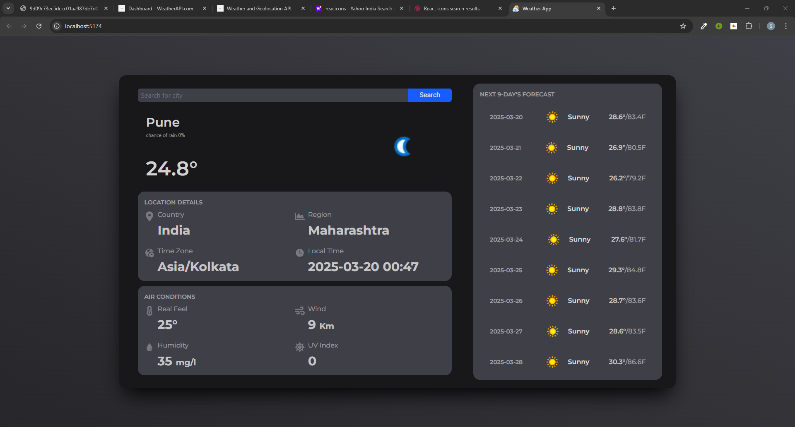

# WeatherApp

WeatherApp is a React-based web application that provides current weather information and a 9-day forecast for any city. It uses the WeatherAPI to fetch weather data.

## Features

- Search for weather information by city.
- Display current temperature, weather conditions, and location details.
- Show a 9-day weather forecast.
- Responsive design with a modern UI.

## Installation

1. Clone the repository:
   ```bash
   git clone https://github.com/Shambhogit/WeatherApp.git
   ```
2. Navigate to the project directory:
   ```bash
   cd WeatherApp
   ```
3. Install the dependencies:
   ```bash
   npm install
   ```

## Usage

1. Start the development server:
   ```bash
   npm run dev
   ```
2. Open your browser and go to `http://localhost:5173`.

## Screenshot



## Technologies Used

- React
- Tailwind CSS
- Axios
- WeatherAPI
- Vite

## License

This project is licensed under the MIT License.
